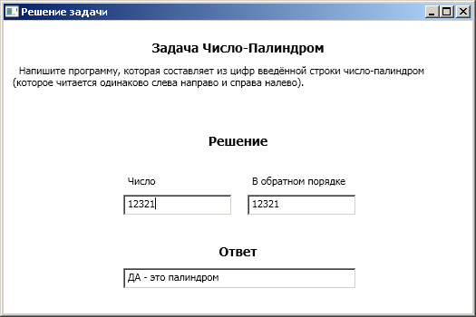
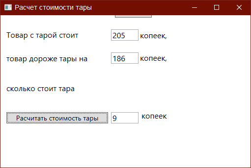
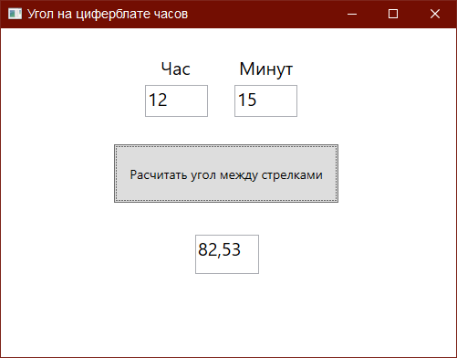

# Задачи с собеседований

  Проходя собеседования в разных компниях начал собирать подборку задач которые задают,
свои решения предлагаю вашему вниманию.

Cреда разработки MS VS 2017 C#. Проект каждой задачи в отдельном  каталоге

1) ЗадачаЧислоПалиндром 
     Напишите программу, которая составляет из цифр введённой строки число-палиндром 
      (которое читается одинаково слева направо и справа налево). 

Следующие задачи выполнены среда разработки MS VS 2010 C# Express.  

 
2) Test01  - самая легкая задача, стоимость тары, даже комментировать не чего

 

3) Test02test  - эта уже чуть посложней , расчитать угол между часовой и минутной стрелкой

  Примерно так - на циферблате 60 минутных делений? значит 1 минутное деление =  [360/60] Градусов , а также минутные деления еще помечены как часовые (каждое 5-е деление) т.е. 12 часовых секторов лежат на 60 минутных делениях, и 1 часовой сектор занимает 5 минутных делений или 30 Градусов.
  Определившись с этим дальнейшее решение заключается в том что бы подсчитать
  Значит минутная стрелка пройдя минуту протащит часовую стрелку на 

в этом решении у меня ошибка.
